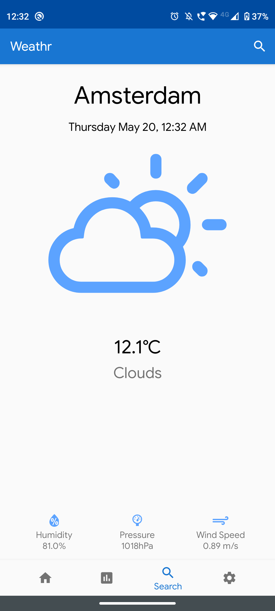

<h1 align="center">Weathr App Android</h1>
<h3 align="center">Introduction</h3>

<b>2-3 Lines of Introduction
  </b>

<h2 align="center">Table of contents </h2>

* <a href="#pagesorfeaturesorcomponents">Pages </a>
* <a href="#tech-and-framework-used">Tech and framework used </a>
* <a href="#link-to-the-project ">Link to the project  </a>
* <a href="#api-libraries-used ">API  </a>
* <a href="#screenshots">Screenshots </a>

## Pages or Features or Components
__Explain the project in further detail it can either the pages or the feature of the project or even the various components of the page

 ## Tech,frameworks and libraries used
* Kotlin
* MVVM
* Collapsible Calendar View
* Weather Icon View

## APIs Used(If any)
* Open Weather API
* Places Autocomplete API

## Link to the project 
  https://play.google.com/store/apps/details?id=com.project.weatherapp

## Screenshots

&nbsp;&nbsp;

&nbsp;&nbsp;

  
 

 

&nbsp;&nbsp;

&nbsp;&nbsp;

  
 

  
 

